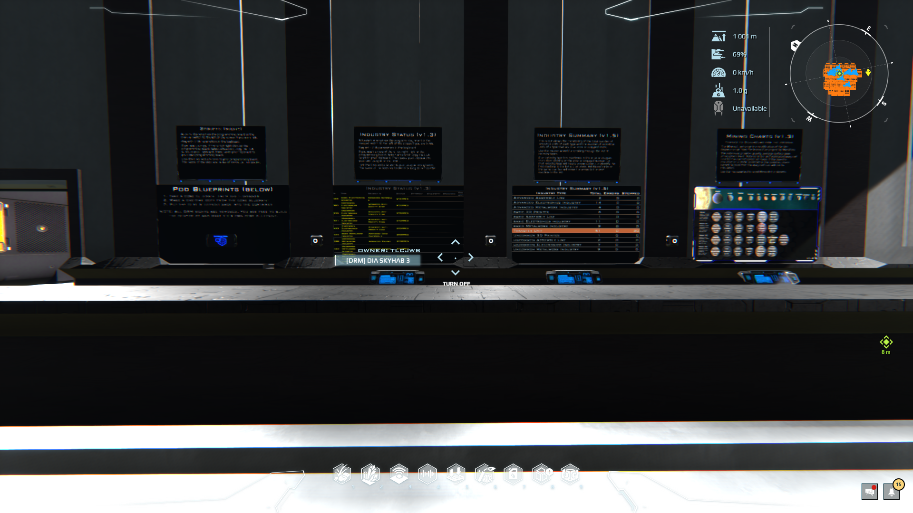

Complements of Marion Enderas. The originals can be found at ::pos{0,2,20.9705,98.6233,1001.1424}

## Mining Charts (v1.3)
 - Thanks to Silverzero for the original
 - The mining chart script is a modification fo the ore explorer sript from the Screen Flair project by SilverZero back in 2020
 - The extension provides gravity, average surgace level, atmospheric level, distance in SU, and extimated warp cell cost for the current construct mass. If the board is mounted on a static construct or the construct mass cannot be read then the warp cell cost will not be calculated.
 - Use the mousewheel to scroll through the planets and its moons

#### Mining Charts Usage
 - Install a keyboard
 - Link the keyboard to the warp engine and the ships dynamic core (required for warp cell cost calculations)
   - If you dont link to the warp & dynamic core the script still works but it wont calculate the warp cell costs
 - Activate the keyboard and turn on the screen
 - Use the middle mouse wheen to scroll through the planets

## Industry summary (v1.5)
 - This script allows the monitoring of the total number of industrial units of each type and the number of industrial units of a type that are in an error or stopped states.
 - Use the mousehweel for scrolling through the list of industrial types.
 - If an industry type has machiens in the error or stopped state the clicking on the error or stopped number for that industry type will create an error stickers to identify the first machine in the list in that state. Addititional clicks on teh same number will move the arror to the next machine in the list.

## Industry Status (v1.3)
 - Link the core and a screen to your programming board. THe name of the slots and the order of the linking do not matter.
